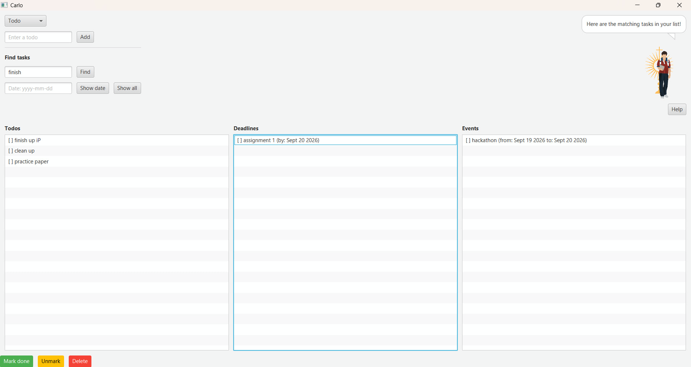

# Carlo User Guide



Carlo is a **desktop app for managing your todos, deadlines, and events**, organised into
three columns so you can see everything at a glance. It's operated by **filling in a form
and pressing Enter or clicking a button** — no commands to memorise.

* [Quick start](#quick-start)
* [Features](#features)
    * [Adding a todo](#adding-a-todo)
    * [Adding a deadline](#adding-a-deadline)
    * [Adding an event](#adding-an-event)
    * [Viewing your tasks](#viewing-your-tasks)
    * [Marking a task as done](#marking-a-task-as-done)
    * [Unmarking a task](#unmarking-a-task)
    * [Deleting a task](#deleting-a-task)
    * [Finding tasks by keyword](#finding-tasks-by-keyword)
    * [Viewing tasks on a specific date](#viewing-tasks-on-a-specific-date)
    * [Getting help](#getting-help)
    * [Supported date/time formats](#supported-datetime-formats)
* [FAQ](#faq)
* [Summary](#summary)

## Quick start

<!-- Confirm the exact Java version your build.gradle targets before publishing. -->
1. Ensure you have Java 17 or above installed on your computer.
2. Download the latest `carlo.jar` from the [releases page](../../releases).
3. Copy the file to the folder you want to use as the home folder for Carlo.
4. Open a terminal in that folder and run:
   ```
   java -jar carlo.jar
   ```
   Carlo's window should appear in a few seconds, greeting you and ready to use.
5. Your tasks are saved automatically to a `data/carlo.txt` file inside that folder, and
   loaded again the next time you open Carlo — there's no separate save command.

## Features

### Adding a todo

Adds a task with no date or time attached — useful for anything you just need to remember
to do at some point.

1. Select **Todo** from the dropdown at the top left (it's selected by default).
2. Type a description into the text field.
3. Press **Enter**, or click **Add**.

The task appears at the bottom of the **Todos** column, and Carlo confirms it in the
speech bubble:

```
Added! You now have 3 tasks in your list!
```

### Adding a deadline

Adds a task that must be completed by a specific date or time.

1. Select **Deadline** from the dropdown.
2. Enter a description in the first field, and the due date/time in the second
   (see [supported formats](#supported-datetime-formats)).
3. Press **Enter** in either field, or click **Add deadline**.

The task appears in the **Deadlines** column, showing its due date:

```
[ ] submit report (by: Dec 2 2019)
```

### Adding an event

Adds a task that starts and ends at specific times.

1. Select **Event** from the dropdown.
2. Enter a description, a start time ("From"), and an end time ("To").
3. Press **Enter** in any field, or click **Add event**.

The event appears in the **Events** column, showing both times:

```
[ ] trip (from: Dec 1 2019 to: Dec 5 2019)
```

The start time must not be later than the end time, or Carlo will let you know instead of
adding the event.

### Viewing your tasks

Your todos, deadlines, and events are always shown in their own column, so there's no
separate "list" action — just look at the columns. Click **Show all** at any time to clear
a keyword or date search and see every task again.

### Marking a task as done

1. Click the task in whichever column it's in, to select it.
2. Click **Mark done**.

The task's checkbox updates to `[X]` in its column.

### Unmarking a task

1. Click the task to select it.
2. Click **Unmark**.

The task's checkbox reverts to `[ ]`.

### Deleting a task

1. Click the task to select it.
2. Click **Delete**.

The task is removed from its column, and Carlo confirms how many tasks are left:

```
Okay okay, I've removed this task!
You now have 2 tasks in your list!
```

### Finding tasks by keyword

Type part of a description into the **Find task** field and press **Enter**, or click
**Find**. Every column updates to show only tasks whose description contains that keyword
(case-insensitive). Click **Show all** afterwards to go back to the full list.

### Viewing tasks on a specific date

Type a date into the **Date** field and press **Enter**, or click **Show date**. This shows
deadlines due on that date and events that span it. Click **Show all** to return to the
full list.

### Getting help

Click the **Help** button underneath Carlo's picture to show a quick summary of how to add
each type of task. Click it again to dismiss the summary and return to the previous
message.

### Supported date/time formats

Dates and times for deadlines and events can be entered as:

| Format | Example |
|---|---|
| `yyyy-mm-dd` | `2019-12-02` |
| `yyyy-mm-dd HHmm` | `2019-12-02 1800` |
| `d/m/yyyy` | `2/12/2019` |
| `d/m/yyyy HHmm` | `2/12/2019 1800` |
| Relative keyword | `today`, `tomorrow`, `yesterday` |

## FAQ

**Q: Do I need to save my data manually?**<br>
A: No — Carlo saves after every change to `data/carlo.txt` in the app's home folder.

**Q: How do I move my data to another computer?**<br>
A: Install Carlo on the other computer, then replace the empty `data/carlo.txt` it creates
with the one from your old home folder.

## Summary

| Action | How |
|---|---|
| Add a todo | Select **Todo**, enter a description, press Enter or click **Add** |
| Add a deadline | Select **Deadline**, enter a description and due date/time, click **Add deadline** |
| Add an event | Select **Event**, enter a description, start, and end time, click **Add event** |
| Mark done | Select a task, click **Mark done** |
| Unmark | Select a task, click **Unmark** |
| Delete | Select a task, click **Delete** |
| Find | Enter a keyword, click **Find** |
| Show tasks on a date | Enter a date, click **Show date** |
| Show all tasks | Click **Show all** |
| Help | Click **Help** |
